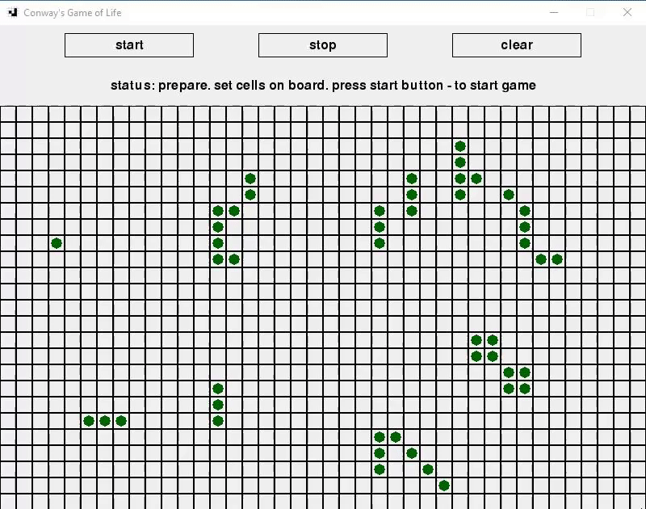
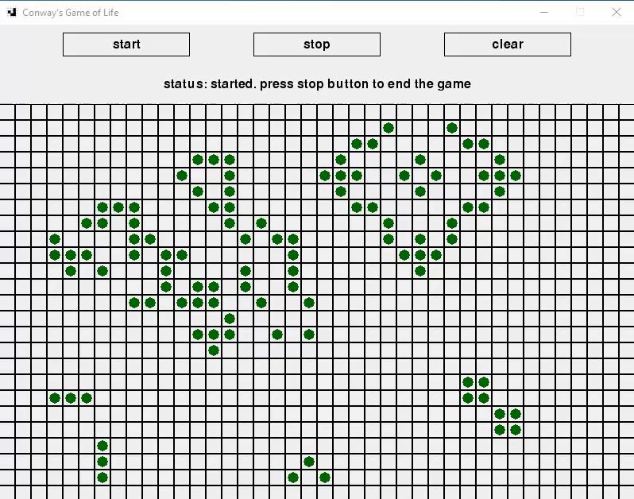

# Conway - Life

John Conway's Game of Life

Memoriam of <strong>John Horton Conway</strong> (26 December 1937 – 11 April 2020)

An English mathematician active in the theory of finite groups, knot theory, number theory, 
combinatorial game theory and coding theory. He also made contributions to many branches of recreational mathematics,
most notably the invention of the cellular automaton called the Game of Life. Conway spent the first half of his 
long career at the University of Cambridge in England, and the second half at Princeton University in New Jersey, 
where he held the title John von Neumann Professor Emeritus. On 11 April 2020, at age 82, he died of COVID-19 at 
his home in New Jersey

<a href="https://en.wikipedia.org/wiki/John_Horton_Conway" target="_blank">More about John Conway in Wikipedia</a> 

<h3>Game: Life</h3> 

 

The area of action of the game - "Life" - are cells, each of which can be in a living (filled)
or dead (empty) state. Each cell has eight neighbors. The game begins with the distribution of living cells in the world 
(first generation) and then continues in automatic mode. At each subsequent stage, the next generation will be calculated 
according to the previous one, following only two rules:

<ol>
<li>In the presence of three neighbors in an empty (dead) cell, life is created - it becomes a living (filled) cell</li>
<li>If a living cell has two or three neighbors, it continues to live, otherwise it dies (empties)</li>
</ol>

The game ends if:

<ul>
  <li>There are no living cells left in the world</li>
  <li>The next configuration repeats the previous configuration (cycled)</li>
  <li>Nothing changes in the next configuration (stabilized)</li>
</ul>

Such simple rules lead to a great variety of figures, which makes this game interesting. Although there are only two 
rules in the game, it has been attracting the attention of scientists for more than fifty years. The game has had a major 
impact on areas of science such as: automaton theory, game theory and mathematical programming, algebra and number theory, 
probability and mathematical statistics, combinatorics and graph theory, fractal geometry, computational mathematics, 
decision making theory. The regularities found in the game find analogies in such sciences as cybernetics, biology, 
bacteriology, physiology, astronomy, quantum physics, nanomechanics, electrical engineering, chemistry.

We start the game by deploying living cells. Clicking on the empty box with the mouse, we will color it, 
and clicking on the filled cell - erase it. After completing the layout, we start the simulation with the start button. 
It can be stopped at any time with the stop button. Clear the board with the clear button and re-deploy the new combination.

 
<a href="https://en.wikipedia.org/wiki/Conway%27s_Game_of_Life" target="_blank">More about Game of Life in Wikipedia</a>
